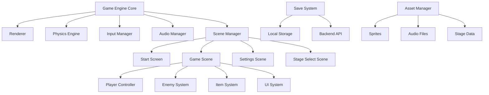

# Design Document

## Overview

スーパーマリオ風横スクロールアクションゲームは、HTML5 Canvas、CSS、JavaScript を使用した Web ベースのプラットフォーマーゲームです。モジュラー設計により段階的な機能拡張を可能にし、将来的なバックエンド統合とマルチプレイヤー機能をサポートします。

## Architecture

### システム全体構成



### レイヤー構造

1. **プレゼンテーション層**: HTML5 Canvas、UI 要素
2. **ゲームロジック層**: ゲームエンジン、物理演算、状態管理
3. **データ層**: ローカルストレージ、将来的には REST API
4. **アセット層**: 画像、音声、ステージデータ

## Components and Interfaces

### Core Game Engine

```javascript
class GameEngine {
  constructor(canvas)
  init()
  update(deltaTime)
  render()
  start()
  stop()
}
```

**責任**: ゲームループ管理、シーン切り替え、全体的な状態管理

### Physics Engine

```javascript
class PhysicsEngine {
  applyGravity(entity)
  checkCollisions(entity, obstacles)
  resolveCollision(entityA, entityB)
  updatePosition(entity, deltaTime)
}
```

**責任**: 重力、衝突判定、物理的な動作の計算

### Player Controller

```javascript
class Player {
  constructor(x, y)
  update(deltaTime, inputState)
  move(direction)
  jump()
  dash()
  block()
  takeDamage()
  collectItem(item)
}
```

**責任**: プレイヤーキャラクターの状態管理、入力処理、アニメーション

### Scene Manager

```javascript
class SceneManager {
  currentScene
  changeScene(sceneName)
  updateCurrentScene(deltaTime)
  renderCurrentScene()
}
```

**責任**: 画面遷移、シーン固有のロジック管理

### Input Manager

```javascript
class InputManager {
  keyStates = {}
  bindKey(key, action)
  isKeyPressed(key)
  isKeyHeld(key)
  update()
}
```

**責任**: キーボード入力の管理、入力イベントの処理

### Audio Manager

```javascript
class AudioManager {
  sounds = {}
  bgm = null
  loadSound(name, url)
  playSound(name)
  playBGM(name)
  setVolume(type, volume)
}
```

**責任**: 効果音と BGM の管理、音量制御

## Data Models

### Player State

```javascript
const PlayerState = {
  position: { x: number, y: number },
  velocity: { x: number, y: number },
  health: number,
  powerLevel: number,
  invincible: boolean,
  invincibleTimer: number,
  coins: number,
  score: number,
  facing: "left" | "right",
  state: "idle" | "running" | "jumping" | "dashing" | "blocking",
};
```

### Game State

```javascript
const GameState = {
  currentStage: number,
  playerState: PlayerState,
  stageProgress: number,
  timeRemaining: number,
  isPaused: boolean,
  gameMode: "playing" | "paused" | "gameover" | "victory",
};
```

### Stage Data

```javascript
const StageData = {
  id: number,
  name: string,
  width: number,
  height: number,
  platforms: Platform[],
  enemies: Enemy[],
  items: Item[],
  background: string,
  music: string,
  specialEffects: SpecialEffect[]
}
```

### Save Data (Phase 2)

```javascript
const SaveData = {
  playerId: string,
  unlockedStages: number[],
  bestScores: { [stageId]: number },
  totalCoins: number,
  achievements: string[],
  settings: {
    soundVolume: number,
    musicVolume: number,
    controls: KeyBindings
  }
}
```

## Error Handling

### Client-Side Error Handling

1. **Asset Loading Errors**

   - 画像や音声ファイルの読み込み失敗時のフォールバック
   - プレースホルダー画像の表示
   - エラーログの記録

2. **Game Logic Errors**

   - 物理演算での異常値検出
   - プレイヤー位置の境界チェック
   - 無限ループの防止

3. **Input Validation**
   - 不正なキー入力の無視
   - 設定値の範囲チェック
   - セーブデータの整合性確認

### Backend Error Handling (Phase 2)

1. **Network Errors**

   - API 通信失敗時のリトライ機構
   - オフラインモードへの自動切り替え
   - ローカルキャッシュの活用

2. **Authentication Errors**
   - トークン期限切れの自動更新
   - ログイン失敗時の適切なメッセージ表示

## Testing Strategy

### Unit Testing

1. **Physics Engine Tests**

   - 衝突判定の精度テスト
   - 重力計算の正確性テスト
   - 境界条件でのテスト

2. **Player Controller Tests**

   - 入力に対する正しい反応のテスト
   - 状態遷移のテスト
   - アニメーション同期のテスト

3. **Game State Tests**
   - スコア計算の正確性テスト
   - セーブ/ロード機能のテスト
   - ステージ進行のテスト

### Integration Testing

1. **Scene Transition Tests**

   - 画面遷移の正常動作確認
   - データの引き継ぎテスト

2. **Audio-Visual Sync Tests**
   - 効果音とアクションの同期テスト
   - アニメーションとゲームロジックの同期テスト

### End-to-End Testing

1. **Complete Gameplay Tests**

   - ステージ開始からクリアまでの完全なプレイテスト
   - 各種アイテム取得のテスト
   - ゲームオーバー条件のテスト

2. **Performance Tests**
   - フレームレート維持のテスト
   - メモリリーク検出
   - 長時間プレイでの安定性テスト

### Browser Compatibility Testing

1. **Cross-Browser Tests**

   - Chrome、Firefox、Safari、Edge での動作確認
   - モバイルブラウザでの動作確認

2. **Performance Optimization**
   - Canvas 描画の最適化
   - 音声再生の最適化
   - アセット読み込みの最適化

## Technical Implementation Details

### Canvas Rendering Strategy

- **レイヤー分離**: 背景、ゲームオブジェクト、UI を別々の Canvas レイヤーで管理
- **スプライトアニメーション**: フレームベースのアニメーションシステム
- **カメラシステム**: プレイヤー追従とスムーズスクロール

### Performance Optimization

- **オブジェクトプーリング**: 敵やアイテムの再利用
- **視界外カリング**: 画面外オブジェクトの描画スキップ
- **アセット遅延読み込み**: 必要に応じたリソース読み込み

### Future Backend Architecture (Phase 2)

- **RESTful API**: プレイヤーデータとステージ情報の管理
- **WebSocket**: リアルタイムマルチプレイヤー機能
- **Database**: PostgreSQL または MongoDB でのデータ永続化
- **Authentication**: JWT トークンベースの認証システム
