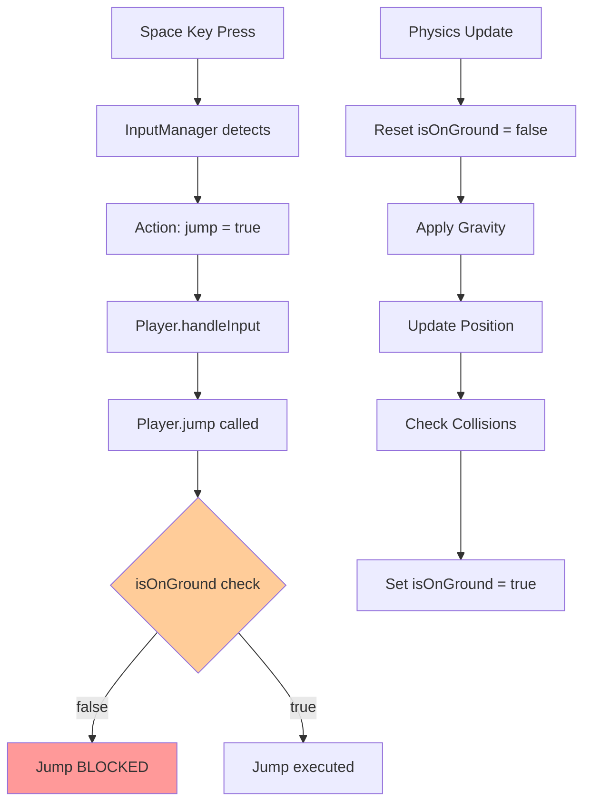
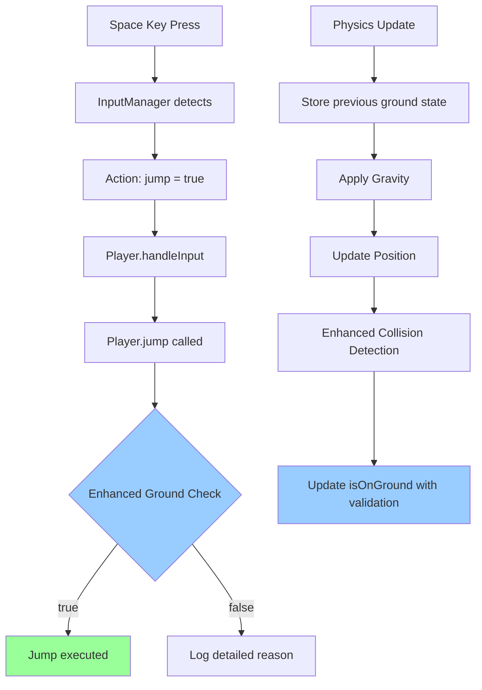

# Design Document

## Overview

ジャンプ機能修正は、現在のマリオスタイルプラットフォーマーゲームで発生している「キー入力は検出されるがジャンプが実行されない」問題を解決するための設計です。調査により、問題の根本原因は以下の通り特定されました：

1. **地面判定の問題**: `isOnGround` 状態が物理エンジンの更新で不正確にリセットされる
2. **更新順序の問題**: 地面判定がジャンプ実行前に誤ってリセットされる
3. **ジャンプ条件の問題**: 地面にいてもジャンプ条件検証が失敗する
4. **物理エンジンの衝突解決**: 地面との衝突解決が不完全

この設計では、これらの具体的な問題に対する段階的な修正アプローチを提供します。

## Architecture

### 現在の問題フロー



### 修正後のフロー



### 修正対象システム

1. **Player Ground Detection**: 地面判定ロジックの強化
2. **Physics Engine Update Order**: 更新順序の最適化
3. **Collision Resolution**: 衝突解決の改善
4. **Jump Validation**: ジャンプ条件検証の寛容化
5. **Debug System**: 詳細な診断機能の追加

## Components and Interfaces

### Enhanced Player Ground Detection

```javascript
class Player {
  constructor() {
    // 既存のプロパティ...
    this.groundDetectionHistory = []; // 地面判定の履歴
    this.lastGroundContact = 0; // 最後に地面に接触した時間
    this.groundTolerance = 5; // 地面判定の許容範囲（ピクセル）
  }

  // 強化された地面判定
  enhancedGroundCheck() {
    // 複数の方法で地面判定を実行
    const physicsGroundCheck = this.isOnGround;
    const positionGroundCheck = this.checkGroundByPosition();
    const velocityGroundCheck = this.checkGroundByVelocity();

    return {
      isOnGround: physicsGroundCheck || positionGroundCheck,
      confidence: this.calculateGroundConfidence(),
      details: { physicsGroundCheck, positionGroundCheck, velocityGroundCheck },
    };
  }

  // 寛容なジャンプ条件検証
  canJumpEnhanced() {
    const groundCheck = this.enhancedGroundCheck();
    const timeSinceGroundContact = performance.now() - this.lastGroundContact;

    // 地面にいるか、最近地面にいた場合はジャンプ可能
    return groundCheck.isOnGround || timeSinceGroundContact < 100; // 100ms の猶予
  }
}
```

### Enhanced Physics Engine

```javascript
class PhysicsEngine {
  // 既存のメソッド...

  // 強化された衝突解決
  resolveCollisionEnhanced(entityA, entityB) {
    const resolution = this.resolveCollision(entityA, entityB);

    // 地面衝突の場合、追加の検証を実行
    if (resolution.direction === "bottom") {
      this.validateGroundCollision(entityA, entityB, resolution);
      this.recordGroundContact(entityA);
    }

    return resolution;
  }

  // 地面衝突の検証
  validateGroundCollision(entity, platform, resolution) {
    // 衝突解決が妥当かチェック
    const isValidGroundCollision =
      entity.velocity.y >= 0 && // 下向きまたは静止
      resolution.overlap.y > 0 && // 実際に重なっている
      resolution.overlap.y < entity.size.height; // 重なりが妥当な範囲

    if (!isValidGroundCollision) {
      console.warn("Invalid ground collision detected", {
        entity: entity.position,
        velocity: entity.velocity,
        overlap: resolution.overlap,
      });
    }

    return isValidGroundCollision;
  }

  // 地面接触の記録
  recordGroundContact(entity) {
    if (entity.lastGroundContact !== undefined) {
      entity.lastGroundContact = performance.now();
    }
  }
}
```

### Jump Diagnostic System

```javascript
class JumpDiagnosticSystem {
  constructor(player, inputManager) {
    this.player = player;
    this.inputManager = inputManager;
    this.jumpAttempts = [];
    this.isRecording = false;
  }

  // ジャンプ試行の記録
  recordJumpAttempt(inputDetected, groundState, jumpExecuted, reason) {
    const attempt = {
      timestamp: performance.now(),
      inputDetected,
      groundState: { ...groundState },
      jumpExecuted,
      reason,
      playerState: {
        position: { ...this.player.position },
        velocity: { ...this.player.velocity },
        isOnGround: this.player.isOnGround,
      },
    };

    this.jumpAttempts.push(attempt);

    // 最新の100回のみ保持
    if (this.jumpAttempts.length > 100) {
      this.jumpAttempts.shift();
    }
  }

  // 診断レポートの生成
  generateJumpDiagnosticReport() {
    const recent = this.jumpAttempts.slice(-10);
    const successful = recent.filter((a) => a.jumpExecuted);
    const failed = recent.filter((a) => !a.jumpExecuted);

    return {
      totalAttempts: recent.length,
      successfulJumps: successful.length,
      failedJumps: failed.length,
      successRate: successful.length / recent.length,
      commonFailureReasons: this.analyzeFailureReasons(failed),
      recommendations: this.generateRecommendations(failed),
    };
  }
}
```

### Enhanced Game Engine Update Loop

```javascript
class GameEngine {
  // 修正された物理更新順序
  updatePhysics(deltaTime) {
    if (!this.player || !this.currentStage) return;

    // 1. 入力処理前の状態を保存
    const preUpdateState = {
      position: { ...this.player.position },
      velocity: { ...this.player.velocity },
      isOnGround: this.player.isOnGround,
    };

    // 2. 重力と摩擦を適用（地面状態は保持）
    this.physicsEngine.applyGravity(this.player, deltaTime);
    this.physicsEngine.applyFriction(
      this.player,
      deltaTime,
      this.player.isOnGround
    );

    // 3. 位置を更新
    this.physicsEngine.updatePosition(this.player, deltaTime);

    // 4. 衝突検出と解決
    const collisions = this.currentStage.checkPlatformCollisions(
      this.player,
      this.physicsEngine
    );

    // 5. 地面判定を更新（より寛容なロジック）
    this.updateGroundStateEnhanced(collisions, preUpdateState);

    // 6. 境界チェック
    this.enforceStagesBounds();
  }

  // 強化された地面状態更新
  updateGroundStateEnhanced(collisions, preUpdateState) {
    let newGroundState = false;

    // 衝突による地面判定
    for (const collision of collisions) {
      if (
        collision.resolution.resolved &&
        collision.resolution.direction === "bottom"
      ) {
        newGroundState = true;
        this.player.lastGroundContact = performance.now();
        break;
      }
    }

    // 境界による地面判定
    const stageBounds = this.currentStage.getBounds();
    if (
      this.player.position.y + this.player.size.height >=
      stageBounds.bottom
    ) {
      newGroundState = true;
      this.player.lastGroundContact = performance.now();
    }

    // 地面状態の変更をログ出力
    if (this.player.isOnGround !== newGroundState) {
      console.log(
        `[PHYSICS] Ground state changed: ${this.player.isOnGround} -> ${newGroundState}`,
        {
          collisions: collisions.length,
          playerBottom: this.player.position.y + this.player.size.height,
          stageBottom: stageBounds.bottom,
          velocity: { ...this.player.velocity },
        }
      );
    }

    this.player.isOnGround = newGroundState;
  }
}
```

## Data Models

### Input Event Data

```javascript
const InputEventData = {
  timestamp: number,
  eventType: "keydown" | "keyup" | "touch" | "click",
  keyCode: string,
  processed: boolean,
  actionTriggered: string | null,
  playerState: {
    position: { x: number, y: number },
    isOnGround: boolean,
    canJump: boolean
  },
  diagnosticInfo: {
    focusState: boolean,
    preventDefault: boolean,
    browserQuirks: string[]
  }
};
```

### Diagnostic Report

```javascript
const DiagnosticReport = {
  testId: string,
  timestamp: number,
  inputEvents: InputEventData[],
  summary: {
    totalEvents: number,
    successfulJumps: number,
    failedJumps: number,
    focusIssues: number,
    browserIssues: number
  },
  issues: {
    type: "focus" | "browser" | "timing" | "state",
    description: string,
    severity: "low" | "medium" | "high",
    recommendation: string
  }[],
  performance: {
    averageResponseTime: number,
    maxResponseTime: number,
    frameDrops: number
  }
};
```

### Browser Compatibility Data

```javascript
const BrowserCompatibilityData = {
  browser: {
    name: string,
    version: string,
    engine: string,
  },
  quirks: {
    preventDefaultRequired: boolean,
    focusIssues: boolean,
    keyEventTiming: "normal" | "delayed" | "batched",
    touchSupport: boolean,
  },
  fixes: {
    eventCapture: boolean,
    focusPolling: boolean,
    keyCodeNormalization: boolean,
    touchFallback: boolean,
  },
};
```

## Error Handling

### Input Event Error Handling

1. **Event Capture Failures**

   - イベントリスナーの重複登録防止
   - passive オプションの適切な設定
   - エラー時の自動復旧機構

2. **Focus Management Errors**

   - フォーカス取得失敗時の代替手段
   - 無限フォーカスループの防止
   - ユーザー操作による強制フォーカス

3. **Browser Compatibility Issues**
   - 未対応ブラウザでの graceful degradation
   - キーイベントの正規化エラー処理
   - タッチイベントフォールバック

### Diagnostic System Error Handling

1. **診断データ収集エラー**

   - メモリ不足時の古いデータ削除
   - 診断機能の自動無効化
   - エラー報告の簡素化

2. **テスト実行エラー**
   - シミュレーションイベントの失敗処理
   - テスト環境の検証
   - 部分的テスト結果の報告

## Testing Strategy

### Unit Testing

1. **Input Manager Tests**

   ```javascript
   describe("Enhanced Input Manager", () => {
     test("should detect space key press", () => {
       // スペースキー検出テスト
     });

     test("should trigger jump action", () => {
       // ジャンプアクション実行テスト
     });

     test("should handle focus loss", () => {
       // フォーカス喪失処理テスト
     });
   });
   ```

2. **Focus Manager Tests**

   ```javascript
   describe("Focus Manager", () => {
     test("should ensure canvas focus", () => {
       // Canvas フォーカステスト
     });

     test("should show focus indicator", () => {
       // フォーカスインジケーターテスト
     });
   });
   ```

### Integration Testing

1. **End-to-End Input Flow**

   - ブラウザイベント → ジャンプ実行の完全フロー
   - 異なるブラウザでの動作確認
   - タッチデバイスでの代替入力テスト

2. **Diagnostic System Integration**
   - リアルタイム診断データ収集
   - 問題検出と報告機能
   - パフォーマンス影響の測定

### Browser Compatibility Testing

1. **Cross-Browser Tests**

   - Chrome, Firefox, Safari, Edge での動作確認
   - モバイルブラウザ（iOS Safari, Chrome Mobile）
   - 古いブラウザバージョンでの互換性

2. **Device-Specific Tests**
   - デスクトップキーボード
   - ラップトップキーボード
   - タッチスクリーンデバイス
   - ゲームコントローラー（将来対応）

### Performance Testing

1. **Input Latency Tests**

   - キー押下からジャンプ実行までの遅延測定
   - 高頻度入力時のパフォーマンス
   - メモリ使用量の監視

2. **Diagnostic Overhead Tests**
   - 診断機能有効時のパフォーマンス影響
   - ログ出力の最適化
   - 本番環境での診断機能無効化

## Implementation Details

### Event Capture Enhancement

```javascript
// 強化されたイベントキャプチャ
const setupEnhancedEventCapture = () => {
  // Passive オプションを適切に設定
  const options = {
    passive: false,
    capture: true,
  };

  // 複数のイベントタイプを監視
  document.addEventListener("keydown", handleKeyDown, options);
  document.addEventListener("keyup", handleKeyUp, options);

  // タッチイベントのフォールバック
  if ("ontouchstart" in window) {
    setupTouchFallback();
  }
};
```

### Focus Management Strategy

```javascript
// フォーカス管理戦略
const focusManagementStrategy = {
  // 積極的フォーカス取得
  aggressiveFocus: true,

  // フォーカスインジケーター
  showFocusIndicator: true,

  // 自動復旧
  autoRecovery: true,

  // ポーリング間隔（ms）
  focusPollingInterval: 100,
};
```

### Diagnostic Data Collection

```javascript
// 診断データ収集戦略
const diagnosticStrategy = {
  // 収集するイベント数の上限
  maxEvents: 1000,

  // 自動クリーンアップ
  autoCleanup: true,

  // パフォーマンス監視
  performanceMonitoring: true,

  // 本番環境での無効化
  disableInProduction: true,
};
```

### Browser Quirks Database

```javascript
// ブラウザ固有の問題と対策
const browserQuirks = {
  chrome: {
    issues: ["focus-timing"],
    fixes: ["delayed-focus-retry"],
  },
  firefox: {
    issues: ["keydown-preventDefault"],
    fixes: ["explicit-preventDefault"],
  },
  safari: {
    issues: ["touch-event-timing"],
    fixes: ["touch-event-debounce"],
  },
  edge: {
    issues: ["legacy-key-codes"],
    fixes: ["key-code-normalization"],
  },
};
```

## Security Considerations

### Input Security

1. **イベント検証**

   - 信頼できるイベントソースの確認
   - 合成イベントの検出と処理
   - 入力頻度制限（DoS 防止）

2. **フォーカス制御**
   - 悪意のあるフォーカス奪取の防止
   - ユーザー操作の確認
   - セキュリティコンテキストの維持

### Privacy Protection

1. **診断データ**

   - 個人情報の収集回避
   - ローカルストレージのみ使用
   - データの自動削除

2. **ブラウザフィンガープリンティング**
   - 最小限のブラウザ情報収集
   - 匿名化された互換性データ
   - オプトアウト機能の提供
