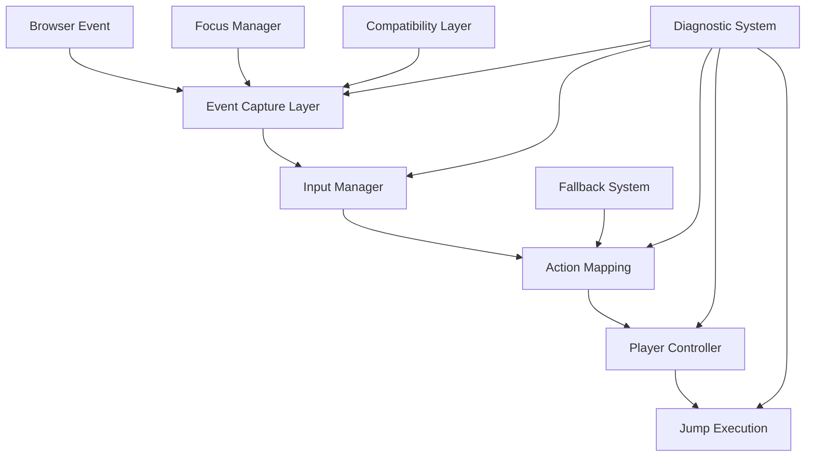

# Design Document

## Overview

スペースキーのジャンプ機能修正は、既存のマリオスタイルプラットフォーマーゲームの入力システムを強化し、確実なスペースキー検出とジャンプ実行を保証するための設計です。問題の根本原因を特定し、段階的な診断機能を実装して、ブラウザ互換性とアクセシビリティを向上させます。

## Architecture

### 問題分析アーキテクチャ



### 修正対象システム

1. **Event Capture Layer**: ブラウザイベントの確実な捕捉
2. **Input Manager**: キー状態管理とアクション変換
3. **Focus Management**: Canvas フォーカス制御
4. **Diagnostic System**: リアルタイム診断とデバッグ
5. **Fallback System**: 代替入力手段の提供

## Components and Interfaces

### Enhanced Input Manager

```javascript
class EnhancedInputManager extends InputManager {
  constructor() {
    super();
    this.diagnosticMode = false;
    this.inputHistory = [];
    this.focusManager = new FocusManager();
    this.compatibilityLayer = new CompatibilityLayer();
  }

  // 診断機能
  enableDiagnostics()
  disableDiagnostics()
  getInputDiagnostics()

  // 強化されたイベント処理
  handleKeyDownEnhanced(event)
  handleKeyUpEnhanced(event)

  // フォーカス管理
  ensureFocus()
  handleFocusLoss()

  // 互換性処理
  normalizeKeyEvent(event)
  detectBrowserQuirks()
}
```

### Focus Manager

```javascript
class FocusManager {
  constructor(canvas) {
    this.canvas = canvas;
    this.hasFocus = false;
    this.focusIndicator = null;
  }

  // フォーカス制御
  ensureCanvasFocus()
  handleFocusChange()
  showFocusIndicator()
  hideFocusIndicator()

  // イベント管理
  setupFocusListeners()
  handleWindowBlur()
  handleWindowFocus()
}
```

### Diagnostic System

```javascript
class InputDiagnosticSystem {
  constructor(inputManager) {
    this.inputManager = inputManager;
    this.diagnosticData = new Map();
    this.isRecording = false;
  }

  // 診断機能
  startDiagnostics()
  stopDiagnostics()
  recordInputEvent(event, stage, result)
  generateDiagnosticReport()

  // テスト機能
  simulateSpaceKeyPress()
  testJumpSequence()
  validateInputChain()
}
```

### Compatibility Layer

```javascript
class CompatibilityLayer {
  constructor() {
    this.browserInfo = this.detectBrowser();
    this.quirks = this.loadBrowserQuirks();
  }

  // ブラウザ検出
  detectBrowser()
  loadBrowserQuirks()

  // イベント正規化
  normalizeKeyEvent(event)
  applyBrowserFixes(event)

  // 代替手段
  setupTouchControls()
  setupOnScreenControls()
}
```

### Fallback Input System

```javascript
class FallbackInputSystem {
  constructor(gameEngine) {
    this.gameEngine = gameEngine;
    this.onScreenControls = null;
    this.touchHandler = null;
  }

  // 代替入力
  createOnScreenControls()
  setupTouchHandlers()
  setupAlternativeKeys()

  // 統合
  integrateWithInputManager()
  handleFallbackInput(action)
}
```

## Data Models

### Input Event Data

```javascript
const InputEventData = {
  timestamp: number,
  eventType: "keydown" | "keyup" | "touch" | "click",
  keyCode: string,
  processed: boolean,
  actionTriggered: string | null,
  playerState: {
    position: { x: number, y: number },
    isOnGround: boolean,
    canJump: boolean
  },
  diagnosticInfo: {
    focusState: boolean,
    preventDefault: boolean,
    browserQuirks: string[]
  }
};
```

### Diagnostic Report

```javascript
const DiagnosticReport = {
  testId: string,
  timestamp: number,
  inputEvents: InputEventData[],
  summary: {
    totalEvents: number,
    successfulJumps: number,
    failedJumps: number,
    focusIssues: number,
    browserIssues: number
  },
  issues: {
    type: "focus" | "browser" | "timing" | "state",
    description: string,
    severity: "low" | "medium" | "high",
    recommendation: string
  }[],
  performance: {
    averageResponseTime: number,
    maxResponseTime: number,
    frameDrops: number
  }
};
```

### Browser Compatibility Data

```javascript
const BrowserCompatibilityData = {
  browser: {
    name: string,
    version: string,
    engine: string,
  },
  quirks: {
    preventDefaultRequired: boolean,
    focusIssues: boolean,
    keyEventTiming: "normal" | "delayed" | "batched",
    touchSupport: boolean,
  },
  fixes: {
    eventCapture: boolean,
    focusPolling: boolean,
    keyCodeNormalization: boolean,
    touchFallback: boolean,
  },
};
```

## Error Handling

### Input Event Error Handling

1. **Event Capture Failures**

   - イベントリスナーの重複登録防止
   - passive オプションの適切な設定
   - エラー時の自動復旧機構

2. **Focus Management Errors**

   - フォーカス取得失敗時の代替手段
   - 無限フォーカスループの防止
   - ユーザー操作による強制フォーカス

3. **Browser Compatibility Issues**
   - 未対応ブラウザでの graceful degradation
   - キーイベントの正規化エラー処理
   - タッチイベントフォールバック

### Diagnostic System Error Handling

1. **診断データ収集エラー**

   - メモリ不足時の古いデータ削除
   - 診断機能の自動無効化
   - エラー報告の簡素化

2. **テスト実行エラー**
   - シミュレーションイベントの失敗処理
   - テスト環境の検証
   - 部分的テスト結果の報告

## Testing Strategy

### Unit Testing

1. **Input Manager Tests**

   ```javascript
   describe("Enhanced Input Manager", () => {
     test("should detect space key press", () => {
       // スペースキー検出テスト
     });

     test("should trigger jump action", () => {
       // ジャンプアクション実行テスト
     });

     test("should handle focus loss", () => {
       // フォーカス喪失処理テスト
     });
   });
   ```

2. **Focus Manager Tests**

   ```javascript
   describe("Focus Manager", () => {
     test("should ensure canvas focus", () => {
       // Canvas フォーカステスト
     });

     test("should show focus indicator", () => {
       // フォーカスインジケーターテスト
     });
   });
   ```

### Integration Testing

1. **End-to-End Input Flow**

   - ブラウザイベント → ジャンプ実行の完全フロー
   - 異なるブラウザでの動作確認
   - タッチデバイスでの代替入力テスト

2. **Diagnostic System Integration**
   - リアルタイム診断データ収集
   - 問題検出と報告機能
   - パフォーマンス影響の測定

### Browser Compatibility Testing

1. **Cross-Browser Tests**

   - Chrome, Firefox, Safari, Edge での動作確認
   - モバイルブラウザ（iOS Safari, Chrome Mobile）
   - 古いブラウザバージョンでの互換性

2. **Device-Specific Tests**
   - デスクトップキーボード
   - ラップトップキーボード
   - タッチスクリーンデバイス
   - ゲームコントローラー（将来対応）

### Performance Testing

1. **Input Latency Tests**

   - キー押下からジャンプ実行までの遅延測定
   - 高頻度入力時のパフォーマンス
   - メモリ使用量の監視

2. **Diagnostic Overhead Tests**
   - 診断機能有効時のパフォーマンス影響
   - ログ出力の最適化
   - 本番環境での診断機能無効化

## Implementation Details

### Event Capture Enhancement

```javascript
// 強化されたイベントキャプチャ
const setupEnhancedEventCapture = () => {
  // Passive オプションを適切に設定
  const options = {
    passive: false,
    capture: true,
  };

  // 複数のイベントタイプを監視
  document.addEventListener("keydown", handleKeyDown, options);
  document.addEventListener("keyup", handleKeyUp, options);

  // タッチイベントのフォールバック
  if ("ontouchstart" in window) {
    setupTouchFallback();
  }
};
```

### Focus Management Strategy

```javascript
// フォーカス管理戦略
const focusManagementStrategy = {
  // 積極的フォーカス取得
  aggressiveFocus: true,

  // フォーカスインジケーター
  showFocusIndicator: true,

  // 自動復旧
  autoRecovery: true,

  // ポーリング間隔（ms）
  focusPollingInterval: 100,
};
```

### Diagnostic Data Collection

```javascript
// 診断データ収集戦略
const diagnosticStrategy = {
  // 収集するイベント数の上限
  maxEvents: 1000,

  // 自動クリーンアップ
  autoCleanup: true,

  // パフォーマンス監視
  performanceMonitoring: true,

  // 本番環境での無効化
  disableInProduction: true,
};
```

### Browser Quirks Database

```javascript
// ブラウザ固有の問題と対策
const browserQuirks = {
  chrome: {
    issues: ["focus-timing"],
    fixes: ["delayed-focus-retry"],
  },
  firefox: {
    issues: ["keydown-preventDefault"],
    fixes: ["explicit-preventDefault"],
  },
  safari: {
    issues: ["touch-event-timing"],
    fixes: ["touch-event-debounce"],
  },
  edge: {
    issues: ["legacy-key-codes"],
    fixes: ["key-code-normalization"],
  },
};
```

## Security Considerations

### Input Security

1. **イベント検証**

   - 信頼できるイベントソースの確認
   - 合成イベントの検出と処理
   - 入力頻度制限（DoS 防止）

2. **フォーカス制御**
   - 悪意のあるフォーカス奪取の防止
   - ユーザー操作の確認
   - セキュリティコンテキストの維持

### Privacy Protection

1. **診断データ**

   - 個人情報の収集回避
   - ローカルストレージのみ使用
   - データの自動削除

2. **ブラウザフィンガープリンティング**
   - 最小限のブラウザ情報収集
   - 匿名化された互換性データ
   - オプトアウト機能の提供
